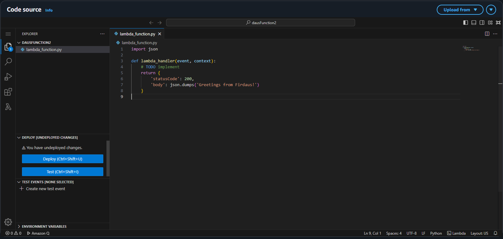
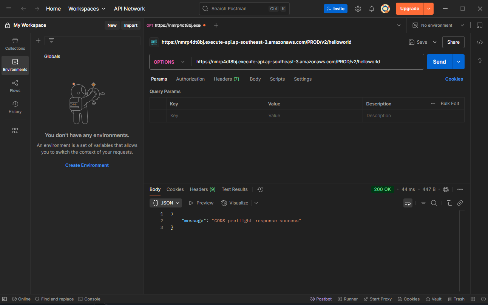
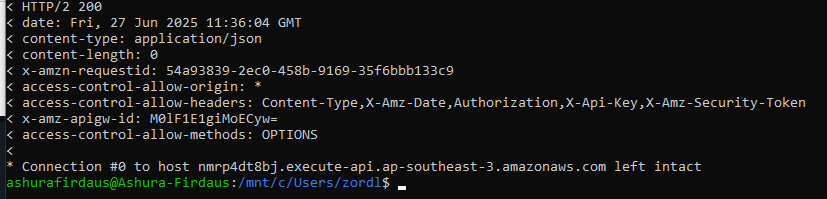
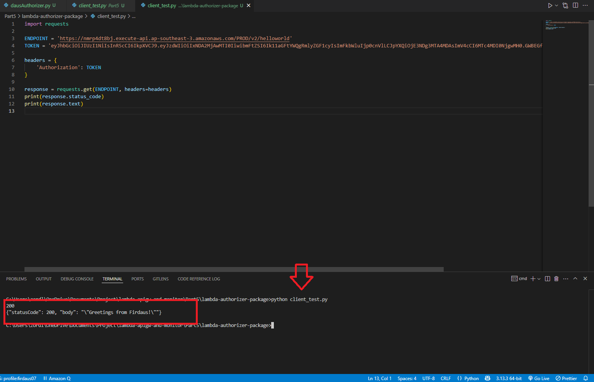

# 🧩 Lambda API Gateway and Monitoring

This project demonstrates how to build a fully serverless API architecture using **AWS Lambda**, **API Gateway**, and **CloudWatch Monitoring**, with additional features like **CORS**, **Canary Deployments**, and **JWT-based Lambda Authorizer**.

---

## **ALL THE STEP BY STEP GUIDE TO CREATE THE PROJECT IN THIS REPO IS AVAILABLE AND CAN BE READ INSIDE THE Docs/PDF FILE**

## 📌 Table of Contents

- [Architecture](#architecture)
- [Features](#features)
- [Getting Started](#getting-started)
- [Deployment Steps](#deployment-steps)
- [Monitoring](#monitoring)
- [Security (Lambda Authorizer)](#security-lambda-authorizer)
- [Tools Used](#tools-used)
- [What I Learned](#what-i-learned)
- [Next Steps](#next-steps)

---

## 🏗️ Architecture

A simple RESTful serverless API with two versions (v1 and v2) using AWS services:
Client → API Gateway → Lambda Functions → (CloudWatch, JWT Auth)

---

## ✨ Features

- 🖥️ Lambda Function with Python runtime
- 🌐 REST API Gateway integration
- 🔁 Canary Deployment for version control
- 🌍 CORS support for cross-origin requests
- 🛡️ JWT-based Lambda Authorizer
- 📈 CloudWatch log monitoring
- 📤 Tested with Postman and curl

---

## 🚀 Getting Started

### Prerequisites

- AWS Account
- IAM permissions for Lambda, API Gateway, CloudWatch
- Postman or curl for API testing
- Python 3 and pip

---

## ⚙️ Deployment Steps

### 1. Create Lambda Function

- Runtime: Python
- Function name: `dausFunction1`
- Test with Hello World event

### 2. Connect to API Gateway

- Create REST API (Regional)
- Create resource `/helloworld`
- Create `GET` method → integrate with Lambda

### 3. Deploy API

- Stage name: `PROD`
- Copy Invoke URL and test via Postman

### 4. Create Canary Deployment

- Create new function: `dausFunction2`
- Update message: `"Greetings from Firdaus!"`
- Split traffic 50/50 in Canary Settings
- Create `/v2/helloworld` resource and method
- Deploy and test new version

### 5. Enable CORS

- Enable OPTIONS method on `/v2/helloworld`
- Add custom response and mapping template
- Deploy and promote Canary

---

## 🕵️ Monitoring

- Use **CloudWatch** to view Lambda logs
- Navigate to Lambda → Monitoring → View Logs in CloudWatch

---

## 🔐 Security (Lambda Authorizer)

1. Generate JWT secret using OpenSSL
2. Create Lambda Authorizer function
3. Use `PyJWT` to decode JWT tokens
4. Add permissions so API Gateway can invoke Lambda
5. Connect Authorizer to `/v2/helloworld` method
6. Test using JWT from [jwt.io](https://jwt.io)

---

## 🛠️ Tools Used

- AWS Lambda
- API Gateway (REST)
- CloudWatch
- Python (runtime & authorizer)
- Postman
- PyJWT
- JWT.io

---

## 📚 What I Learned

- Full AWS serverless API deployment
- Canary deployment with live traffic shifting
- CORS handling using OPTIONS method
- JWT token creation and validation via Lambda
- Using CloudWatch for real-time debugging

---

## 🔮 Next Steps

- Integrate with DynamoDB
- Add frontend client interface
- Implement rate-limiting and API keys
- Build reusable Terraform template

---

## 📸 Screenshots

__

__

__

__

__

__

---

## 👨‍💻 Author

**Muhamad Firdaus**

---

## 📄 License

This project is licensed under the MIT License - see the LICENSE file for details.
